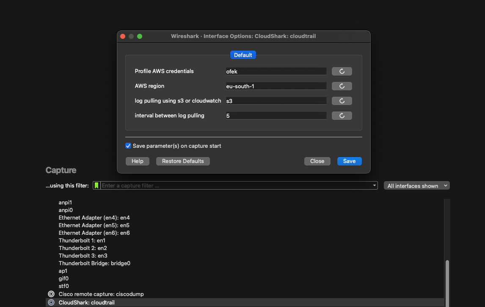
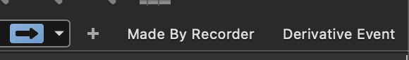

## Usage
Run Wireshark & Configure aws credentials


If you have SSO login to yours account just use,
```bash
aws configure sso
```

You can also use for defualt user,
```bash
aws configure 
```
## Configurations
By default, the tool stops and starts the trail it creates. If you want it to be always on, change `lib/constants.py`.

## Custom Filters


### Made By Recorder
We created a custom filter based on the role you use to record. Using this, you are able to view only the events made by your role.

### Derivative Event
Using this filter, you can view events that were triggered by AWS in response to other events or due to running services.